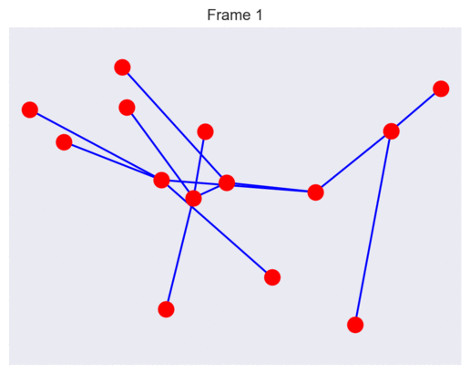

# Force-Directed-Layouts-in-Python
First test of Force Directed view layouts in Python

# Raison D'être 
A stand-alone project, this time written in Python, to experiment with the Force-Directed Layout method for arranging our nodes on the screen.

# Method
Several techniques for applying Force-Directed Layouts to a bunch of vertices (nodes) connected by edges (links) in a graph.  The variations seem to be either for quicker convergence of complicated graphs or more efficient drawing of large graphs.  Time will tell if we need any of these enhancements and we will go with a basic implementation for now.

This basic method is the one described in Section 12.2 of [this book](http://cs.brown.edu/people/rtamassi/gdhandbook/chapters/force-directed.pdf) and is based upon that of [Fruchterman and Reingold (1991)](http://citeseerx.ist.psu.edu/viewdoc/download?doi=10.1.1.13.8444&rep=rep1&type=pdf).  We treat the links as springs which have an attractive force and the nodes as magnets that repel each other.  The implementation does not actually treat these effects as proper forces, but rather as simple position changers.

Each spring links two nodes, $`u`$ and $`v`$.  The vector from node positions   is denoted by $`\vec{r}_{uv}`$ so that the unit vector describing the direction from $`u`$ to $`v`$ is

$`\hat{r} = \frac{\vec{r}_{uv}}{|\vec{r}_{uv}|}`$

The spring force acts between nodes for which there is a link and is given by the (not very physical)

$`F_a = \frac{|\vec{r}|}{l}\hat{r}`$

where $`l`$ is the spring's natural length.  The repulsive force acts between all nodes, although there is a variant that only acts between nodes not connected by a link, and is given by

$`F_r = -C\frac{l^2}{|r|^2}\hat{r}`$

where $`C`$ is a constant that scales the relative strengths of the attractive and repulsive forces.

This process is iterative.  Over a number of steps the "forces" are calculated and applied directly to the nodes' positions rather than to their velocities.  Whilst $`C`$ controls the relative strength of the forces, a $`\delta`$ term is used to control the overall speed of convergence.  Setting this too high can lead to instability.

$`\vec{p_u} \leftarrow \vec{p_u} + \delta\big( \sum_{u\neq v}F_r(u,v) + \sum_{u\leftrightarrow v}F_a(u,v)\big)`$

# Behaviour
A lot comes down to the value of $`C`$.  Setting it too high causes the whole arrangement to expand uncontrollably but setting it too low causes the network to become stuck in a sub-optimal position, aesthetically-speaking.  Trial and error led to a value of $`C=0.5`$ being selected, although [the book](http://cs.brown.edu/people/rtamassi/gdhandbook/chapters/force-directed.pdf) recommended

$`C = l\frac{N}{A}`$

where $`N`$ is the number of vertices and $`A`$ is the area covered by the nodes.

The convergence speed constant was set to the maximum value that didn't cause instability, $`\delta=20`$.

Several authors propose slowing down the convergence as the number of iterations increase.  It was found that this could lead to failed convergence if it was too sharp a decrease, but that it did lead to smoother convergences.  At every step $`\delta`$ was multiplied by 0.99, meaning that by the end of 50 iterations $`\delta = 12.1`$.

For a test graph of 14 nodes, starting in random positions, convergence is nearly always successful:

